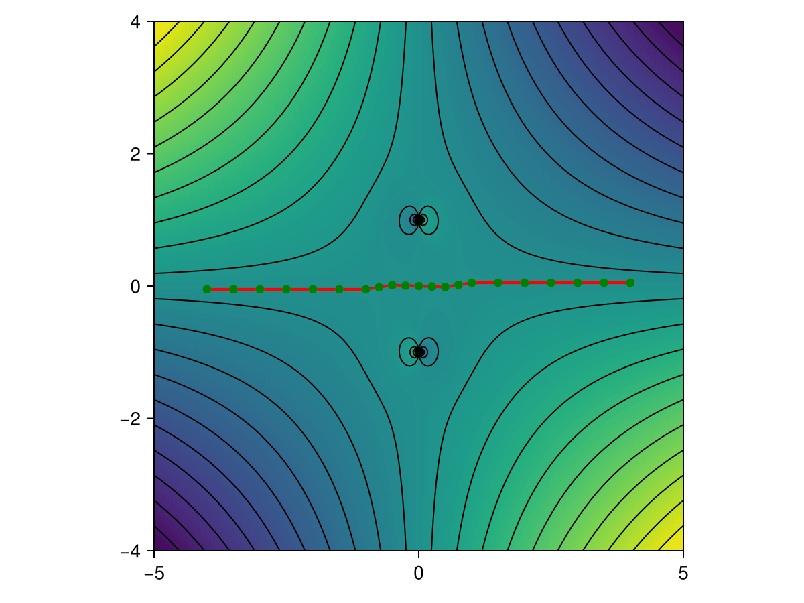
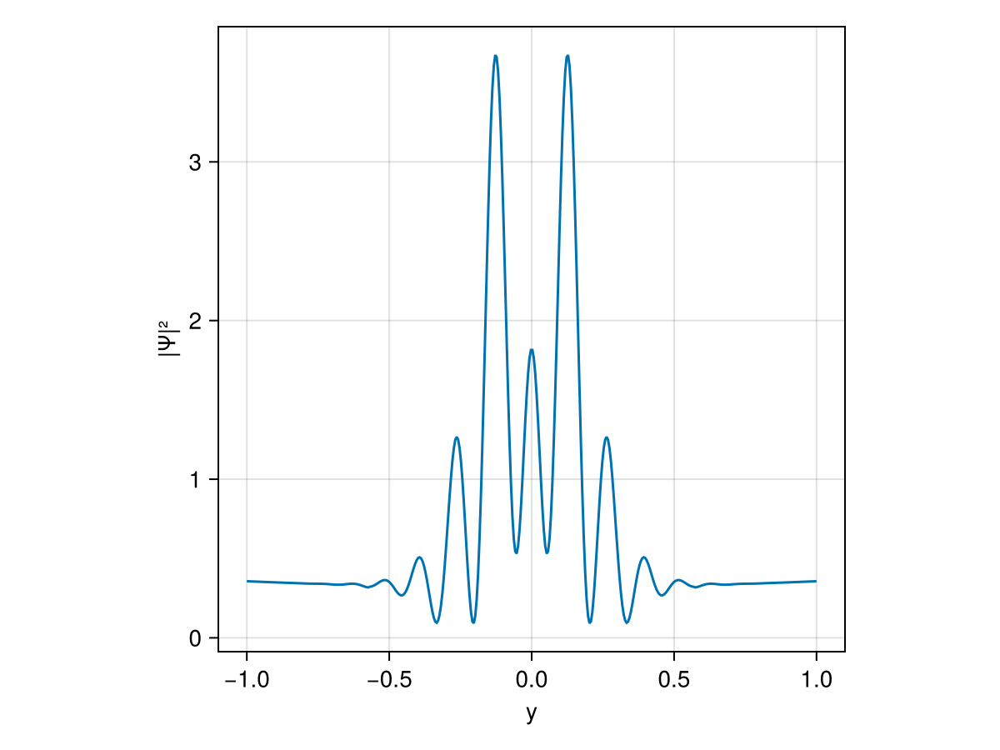

```@meta
CurrentModule = PicardLefschetzIntegration
```

# Theory
Picard-Lefschetz theory formalises the famous saddle point method for multidimensional integrals. In the process, it provides a systematic method to evaluate highly oscillatory integrals. We here briefly describe Picard-Lefschetz theory and the implementation of the present package.

## Picard-Lefschetz theory
For a $d$-dimensional oscillatory integral

```math
I = \int_D e^{i k f(\boldsymbol{x})}\mathrm{d}\boldsymbol{x}\,,
```

with a meromorphic exponent $f$, we use Cauchy's integral theorem to deform the original integration domain into a set of steepest descent manifolds $\mathcal{J}_j$ in the complex plane $\mathbb{C}^d$, 

```math
I = \sum_j n_j \int_{\mathcal{J}_j} e^{i k f(\boldsymbol{x})}\mathrm{d}\boldsymbol{x}\,.
```

A saddle point is relevant, *i.e*, the descent manifold $\mathcal{J}_j$ associated with the critical point $\boldsymbol{x}_j$ contributes to the deformation when the intersection number $n_j \in \mathbb{Z}$ is non-zero. When $n_j \neq 0$, the critical point $\boldsymbol{x}_j$ is relevant to the integral. When $n_j=0$, the critical point $\boldsymbol{x}_j$ is irrelevant. Remarkably, the intersection number $n_j$ of the critical point $\boldsymbol{x}_j$ is given by the number of times its associated steepest ascent manifold $\mathcal{K}_j$ intersects the original integration domain $D$, *i.e.*, $n_j = \langle D, \mathcal{K}_j\rangle$. This deformation is optimal as the Cauchy-Riemann equations guarantee that the integrand no longer oscillates along the steepest descent manifold.

Given an oscillatory integral, its evaluation has been reduced to computing the intersection numbers $n_j$ and the associated relevant steepest descent manifolds $\mathcal{J}_j$.

## Integrating along the Lefschetz thimbles
The evaluation of the integral along the Lefschetz thimbles in the complex plane is implemented in five steps

* This package triangulates the original integration domain $D$ into a set of simplices 
```math
\{[\boldsymbol{p}_{n_1}\dots \boldsymbol{p}_{n_{d+1}}], 
  [\boldsymbol{p}_{n_{d+2}} \dots \boldsymbol{p}_{n_{2d+2}}], \dots \}\,.
```

* We flow the vertices of the simplices in the complex plane, following the downward flow
```math
\frac{\partial \gamma_\lambda(\boldsymbol{x}_0)}{\partial \lambda} = - \overline{\frac{\partial S(\gamma_\lambda(\boldsymbol{x}_0))}{\partial \boldsymbol{x}}}\,,
```
with the boundary condition $\gamma_{\lambda = 0}(\boldsymbol{x}_0) = \boldsymbol{x}_0$. In particular, using the Euler method, we evolve the points $\boldsymbol{p}_j$ using the rule 
```math
\boldsymbol{p}_j \mapsto \boldsymbol{p}_j - \epsilon \overline{\frac{\partial S(\boldsymbol{p}_j)}{\partial \boldsymbol{x}}}\,,
```
with step size $\epsilon$. 

* The downward flow of the original integration domain only converges to the relevant Lefschetz thimbles as a manifold, not as a set of points. Consequently, we need to subdivide the simplices when they become too large. Specifically, we check whether the longest edge of a simplex exceeds the threshold $\delta$ and split the simplex into two simplices by introducing a new vertex at the midpoint of the longest edge.

* Finally, points for which the real part of the exponent 
```math
h(\boldsymbol{x}) = \text{Re}[i f(\boldsymbol{x})]
```
drops below the threshold $\tau$, can be safely removed from the tessellation of the integration domain as the integrand in the point and the consequent contribution to the integral becomes exponentially small.

* Finally, after deforming the integration domain in the complex plane and approximating the relevant steepest descent manifolds, we integrate along the simplices with a simplex Gaussian quadrature scheme.

## Example integral
We illustrate this integration scheme for the one-dimensional lens integral 

```math
\Psi(y) = \sqrt{\frac{\omega}{2\pi i}} \int_{-\infty}^\infty e^{i \omega \left(\frac{(x-y)^2}{2} + \frac{1}{1+x^2}\right)}\mathrm{d}x\,,
```

known as the one-dimensional Lorentzian lens model. This integral depends on the frequency $\omega$ and the time delay function 

```math
T(x,y) = \frac{(x-y)^2}{2} + \frac{1}{1+x^2}\,,
```

where the first term has a geometric origin, corresponding to the relative path length from the source to the point $x$ on the lens plane and the observer at $y$ in the image plane. The second term is the phase variation of the lens model.

First, we represent the integration domain by a set of line segments. Next, we flow the line segments into the complex plane $\mathbb{C}$ using the downward flow. The flow converges to the relevant thimbles. For example, for $y=0$, we obtain the thimble

[]()

Along the deformed integration domain, the integrand no longer oscillates, allowing for an efficient evolution of the lens amplitude. The intensity $|\Psi(y)|^2$, with the angular frequency $\omega = 20$, assumes the form 

[]()
